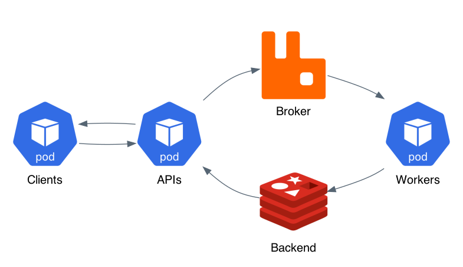

# Ml Models in Production
[](https://www.python.org/doc/)
[](https://docs.celeryproject.org/en/stable/getting-started/introduction.html)
[](https://www.rabbitmq.com/)
[](https://redis.io/)
[](https://reactjs.org/)

This repo gives an introduction to how to make full working example to serve your model using asynchronous Celery tasks and FastAPI. This post walks through a working example for serving a ML model using Celery and FastAPI. All code can be found in this repository. We won’t specifically discuss the ML model used for this example however it was trained using coco dataset with 90 object class like cat, dog, bird ... more detail here [Coco Dataset](https://cocodataset.org/#home). The model have been train with tensorflow [Tensorflow](https://github.com/tensorflow/models) 

## Screenshots & Gifs
[


## Contents
- [Screenshots & Gifs](#screenshots--gifs)
- [Example](#example)
    - [1. Install docker, docker-compose](https://github.com/apot-group/real-time-analytic#1-install-docker-and-docker-compose)
    - [2. Pull git repo](https://github.com/apot-group/real-time-analytic#2-pull-git-repo)
    - [3. Start Server](https://github.com/apot-group/real-time-analytic#3-start-server)
- [Contact Us](#contact-us)


## Example

### 1. Install docker and docker-compose

`https://www.docker.com/`

### 2. Pull git repo
`git clone https://github.com/apot-group/real-time-analytic.git` 

### 3. Start Server
`cd real-time-analytic && docker-compose up`

| Service               | URL                              | User/Password                                 |
| :-------------------: | :------------------------------: | :-------------------------------------------: |
| Druid Unified Console | http://localhost:8888/           | None                                          |
| Druid Legacy Console  | http://localhost:8081/           | None                                          |
| Superset              | http://localhost:8088/           | docker exec -it superset bash superset-init   |
| Airflow               | http://localhost:3000/           | a-airflow/app/standalone_admin_password.txt   |

### 3. Create Dashboard sample from druid streaming
 - Airflow dags at a-airflow/app/dags/demo.py each one min sent message to kafka 'demo' topic with data of list coin ['BTC', 'ETH', 'BTT', 'DOT'] the structure of data message like below.
```
   {
        "data_id" : 454,
        "name": 'BTC',
        "timestamp": '2021-02-05T10:10:01'
    }
```

 - From druid load data from kafka ```kafka:9092```, choice ```demo``` topic and config data result table
<div>
    
</div>
<br>

 - From superset add druid like database sqlalchemy uri: ```druid://broker:8082/druid/v2/sql/```. more detail at [Superset-Database-Connect](https://superset.apache.org/docs/databases/db-connection-ui)
 - Create Chart and dashboard on superset from ```demo``` table.
 - Enjoy! :fire: :fire: :fire:

## Contact Us
- Email-1: duynnguyenngoc@hotmail.com - Duy Nguyen :heart: :heart: :heart: 